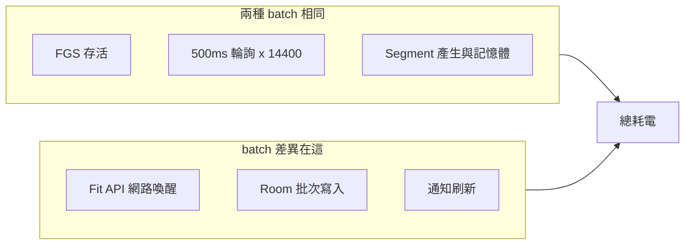

# APBFit — 2 小時 Run：batch=3 vs batch=6 耗電／喚醒對照

| Field | Value |
|---|---|
| Project | APBFit — Auto Personal Boost Fit |
| Document | Technical Analysis / Power & Wake Estimate |
| Status | Reference |
| Date | 2026-06-21 |
| Author | Pixson |
| Related | [SDS v1.2](APBFit_SDS_v1.2_public.md), [SRS v1.2](APBFit_SRS_v1.2_public.md), [Issue #5](https://github.com/Pixson-Lin/APBFit/issues/5) |
| Code | [`RunSessionPowerEstimate.kt`](../app/src/main/java/com/pixson/apbfit/domain/RunSessionPowerEstimate.kt) |

---

## 前提與資料來源

本估算以**單一 Google 帳號、一條 `AccountRunContext` loop** 為單位（[`AccountRunContext.kt`](../app/src/main/java/com/pixson/apbfit/service/AccountRunContext.kt)）。多帳號 session 為平行 loop，下列數字 **× 啟用帳號數**（無線電可能略重疊，非嚴格線性）。

| 參數 | 程式／規格值 |
|------|----------------|
| Run 時長 | **120 分鐘**（7,200 秒） |
| 每段時長 | `uniform(25, 35)` 秒，平均 **30 秒**（[`SegmentGenerator.kt`](../app/src/main/java/com/pixson/apbfit/domain/fit/SegmentGenerator.kt)） |
| 預期 segment 數 | **≈ 240**（7,200 ÷ 30；實際約 206–288） |
| 每 batch Fit 寫入 | **3 次** `insertData`（步數／距離／活動）（[`GoogleFitWriter.kt`](../app/src/main/java/com/pixson/apbfit/domain/fit/GoogleFitWriter.kt)） |
| API timeout | 每次最多 **10 秒**（[`FitConstants.kt`](../app/src/main/java/com/pixson/apbfit/domain/fit/FitConstants.kt)） |
| Stop 輪詢 | `delay` 以 **500ms** 切片（`STOP_POLL_INTERVAL_MS`） |
| 現況 WakeLock | **無**（估算分兩種情境，見 §四） |

```mermaid
sequenceDiagram
    participant Loop as AccountRunLoop
    participant Timer as delay_500ms_chunks
    participant Fit as GoogleFitWriter
    Note over Loop: 每 segment 約 25-35s
    loop perSegment
        Loop->>Timer: delay 500ms x N
        Loop->>Loop: generate segment
        alt queueSize >= batchSize
            Loop->>Fit: insertData x3
            Loop->>Loop: Room insertSegments
        end
    end
```

程式化估算（單元測試鎖定數字）見 [`RunSessionPowerEstimateTest.kt`](../app/src/test/java/com/pixson/apbfit/domain/RunSessionPowerEstimateTest.kt)。

---

## 一、喚醒／活動頻率對照（理想準時執行）

在 **關屏但 loop 能準時跑**（例如未進 Doze，或已加 `PARTIAL_WAKE_LOCK`）時：

| 事件類型 | batch=3 | batch=6 | 說明 |
|----------|---------|---------|------|
| **Segment 完成次數** | ~240 | ~240 | 由時長決定，與 batch **無關** |
| **500ms 輪詢醒來** | **~14,400** | **~14,400** | 每 segment 平均 30s ÷ 0.5s = 60 次；240 × 60 |
| **Batch 寫入（重負載）** | **~80** | **~40** | 240÷3 vs 240÷6（整除時無尾批差異） |
| **Fit `insertData` 總次數** | **~240** | **~120** | 每 batch 固定 3 次 |
| **Room segment 寫入筆數** | ~240 | ~240 | 相同 |
| **通知更新（`onProgress`）** | ~80 | ~40 | 每成功 batch 一次 |
| **平均 batch 間隔（牆鐘）** | ~90 秒 | ~180 秒 | 3×30s vs 6×30s |

### 每小時換算（單帳號）

| 指標 | batch=3 | batch=6 |
|------|---------|---------|
| 重負載 batch／hr | ~40 | ~20 |
| Fit API 呼叫／hr | ~120 | ~60 |
| 500ms 輪詢／hr | ~7,200 | ~7,200 |

**結論（頻率）**：batch 從 3 改 6，**只減半「寫入相關」喚醒**；**segment 計時輪詢完全不變**，且佔絕大多數 timer 次數。

---

## 二、耗電模型（粗略）

### 參考基線

- 假設手機電池：**4,000 mAh × 3.85 V ≈ 15.4 Wh（≈100%）**
- **2 小時關屏閒置**（不跑 APBFit）：約 **4–6%** 電量（中階 Android、Wi‑Fi 開、一般省電設定；實際 3–8% 皆可能）

以下「APBFit 增量」= 在關屏閒置基線之上，因 Run 額外多掉的電。

### 耗電組成（單帳號、2 小時）



| 組成 | batch=3 增量 | batch=6 增量 | 備註 |
|------|--------------|--------------|------|
| **A. PARTIAL_WAKE_LOCK 持鎖 2hr**（若採用） | +0.5–2% | +0.5–2% | 鎖本身不大；**阻止深度睡眠**才是主因 |
| **B. 500ms 輪詢維持可排程** | +1.5–4% | +1.5–4% | 兩者相同；目前架構下最大固定開銷 |
| **C. Segment 輕量 CPU** | +0.1–0.3% | +0.1–0.3% | 產生亂數、deque 操作 |
| **D. Fit API 網路 burst** | +0.8–2.0% | +0.4–1.0% | 假設每次 `insertData` 平均喚醒無線電 ~0.5–1.5s |
| **E. Room + 通知** | +0.1–0.3% | +0.05–0.15% | batch 次數減半略省 |
| **APBFit 總增量（估）** | **+2.5–7%** | **+2.0–5.5%** | 區間重疊大，見下 |

### 總電量百分比（2 小時 Run 期間）

以「滿電 = 100%」表達**這 2 小時內**預期掉電（含閒置基線）：

| 情境 | batch=3 | batch=6 | batch=6 相對 batch=3 |
|------|---------|---------|----------------------|
| **關屏閒置基線** | 4–6% | 4–6% | — |
| **+ APBFit（有 WakeLock、準時 loop）** | **7–12%** | **6–10%** | 約省 **0.5–1.5%**（相對滿電） |
| **僅 APBFit 增量** | **+2.5–7%** | **+2.0–5.5%** | 約省 **0.3–1.5%** |

換算成「若這 2 小時本來會掉 5%，加 APBFit 後」：

- batch=3：**約 7.5–12%**（5% + 2.5–7%）
- batch=6：**約 7–10.5%**（5% + 2–5.5%）

**batch=6 比 batch=3 省電約 5–20% 的「APBFit 增量」**（不是省 50% 總電），因為 **~70–85% 的 APBFit 開銷來自 segment 輪詢 + WakeLock 防 Doze**，與 batch 無關。

---

## 三、典型 2 小時時間軸（單帳號、平均 30s/段）

| 時間 | batch=3 | batch=6 |
|------|---------|---------|
| 0:00 | Run 開始、FGS | 同左 |
| 0:01:30 | 第 1 次 batch 寫入（3 段） | — |
| 0:03:00 | 第 2 次 batch | 第 1 次 batch（6 段） |
| 1:00 | ~40 次 batch、~120 次 API | ~20 次 batch、~60 次 API |
| 2:00 | ~80 次 batch、結束 | ~40 次 batch、結束 |

**活躍無線電時間（粗估）**：若每次 batch 寫入平均讓 Wi‑Fi/基帶醒 **2–4 秒**：

- batch=3：80 × 3s ≈ **240s（4 分鐘）** 無線電活躍
- batch=6：40 × 3s ≈ **120s（2 分鐘）**

2 小時中無線電因寫入而醒著的時間占比：**3.3% vs 1.7%**——仍遠小於 500ms 輪詢對 CPU 睡眠的影響。

---

## 四、現況（無 WakeLock、關屏 Doze）與此對照的關係

目前程式**沒有** WakeLock；關屏後 `delay()` 可能被凍結（[Issue #5](https://github.com/Pixson-Lin/APBFit/issues/5)）。

| 情境 | 實際喚醒／耗電 vs 上表 |
|------|------------------------|
| **關屏 + Doze（現況）** | 輪詢與寫入**遠低於**上表；總耗電可能**更低**，但 segment **漏寫** |
| **關屏 + WakeLock（建議緩解）** | 接近上表「準時 loop」 |
| **螢幕常亮開著 App** | 遠高於上表（螢幕本身 2hr 可達 **30–50%+**） |

因此：**batch=3 vs batch=6 的耗電差異，只有在 loop 真的能準時跑時才有意義**；在 Doze 漏寫情境下，兩者都可能「很省電但沒紀錄」。

---

## 五、實務建議（供後續 #5 設計參考）

1. **若目標是省電**：調大 batch（3→6）只能省 **~0.5–1.5% / 2hr**，效益有限。
2. **若目標是可靠寫入**：應優先處理 **500ms 輪詢 + WakeLock 組合**（或改為 alarm／預生成排程），比調 batch 影響大得多。
3. **多帳號**：2 帳號同 session → Fit API 與 batch 次數約 **×2**；500ms 輪詢也 **×2**（兩條平行 coroutine）。
4. **強度（快走／慢跑）**：只影響每段步數，**不影響**喚醒頻率。

---

## 六、不確定性與驗證方式（若要實測）

估算誤差主要來自：OEM 省電策略、Wi‑Fi vs 行動網路、Google Play services 回應時間、是否忽略電池最佳化。

若要驗證：

1. 同一手機、滿電、關屏、已關閉 APBFit 電池最佳化。
2. 跑兩次 2hr：batch=3 與 batch=6，記 `adb shell dumpsys batterystats` 或系統「電池用量」。
3. 預期：**兩次總掉電差距 < 2%**；若差距明顯更大，代表網路或 Fit 延遲異常。

---

## 摘要

| 問題 | 答案 |
|------|------|
| 2hr 預期 segment 數 | ~240（與 batch 無關） |
| batch=3 vs 6 最大差異 | **寫入次數減半**（80 vs 40 batch；240 vs 120 API） |
| 相同部分 | **~14,400 次 500ms 輪詢**（主因） |
| 2hr 總掉電（含閒置、有 WakeLock） | batch=3：**7–12%**；batch=6：**6–10%** |
| batch=6 可省 | 約 **0.5–1.5%** 滿電（或 APBFit 增量的 5–20%） |

**batch 大小不是省電主旋鈕**；在 2 小時 run 下，它主要影響 Fit API 呼叫頻率與失敗時的資料粒度，對總耗電影響次要。
