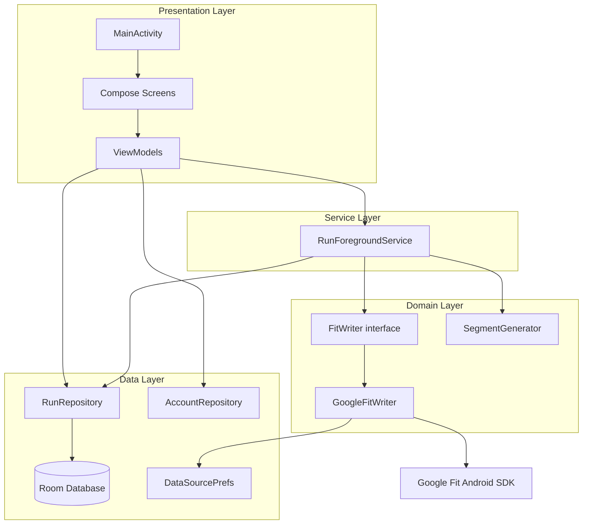
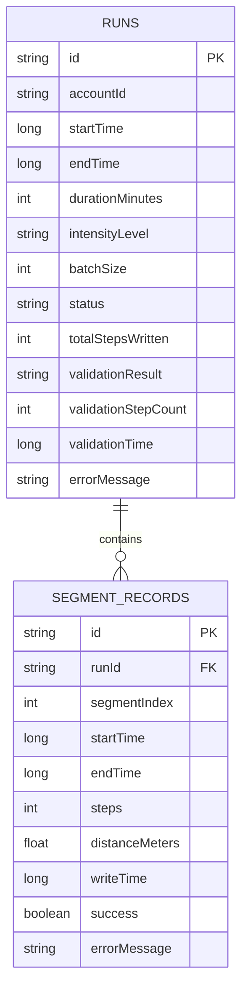
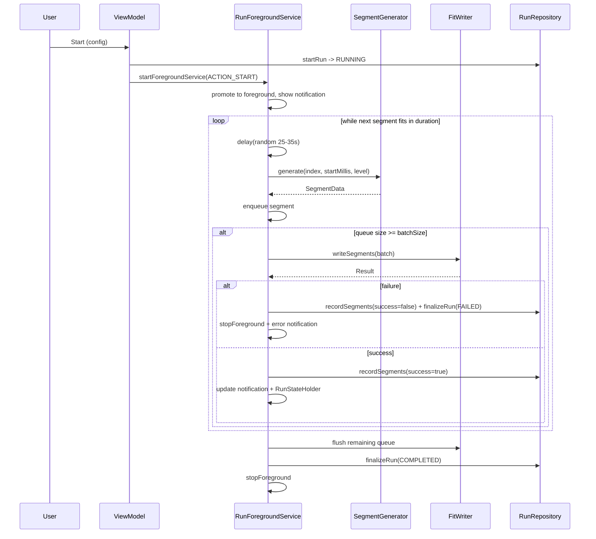
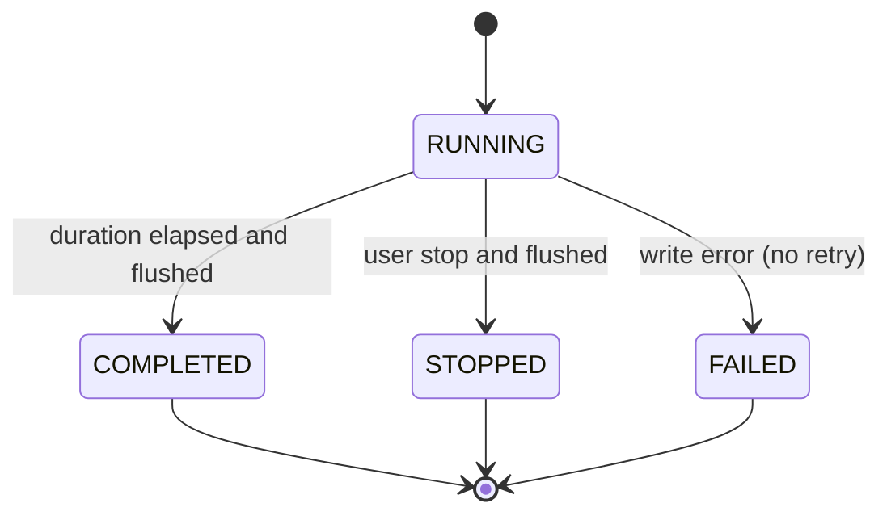

# APBFit — Software Design Specification (SDS)

| Field | Value |
|---|---|
| Project | APBFit — Auto Personal Boost Fit |
| Document | Software Design Specification |
| Version | 1.0 |
| Status | Draft for Implementation |
| Date | 2026-06-11 |
| Related Documents | [SRS v1.0](APBFit_SRS_v1.0_public.md), [Development Guide](APBFit_Cursor_Prompt_public.md) |

---

## Table of Contents

1. [Introduction](#1-introduction)
2. [Design Overview](#2-design-overview)
3. [Detailed Component Design](#3-detailed-component-design)
4. [Data Design](#4-data-design)
5. [Interface Design](#5-interface-design)
6. [Behavioral Design](#6-behavioral-design)
7. [Cross-Cutting Concerns](#7-cross-cutting-concerns)
8. [Requirements Traceability](#8-requirements-traceability)
9. [Testing Strategy](#9-testing-strategy)
10. [Implementation Plan and Sprint Breakdown](#10-implementation-plan-and-sprint-breakdown)
11. [Risks and Mitigations](#11-risks-and-mitigations)
12. [Open Questions](#12-open-questions)

---

## 1. Introduction

### 1.1 Purpose

This Software Design Specification (SDS) translates the requirements defined in the [SRS v1.0](APBFit_SRS_v1.0_public.md) into a concrete software design. It describes the system architecture, component decomposition, data and interface design, behavioral models, and the planned implementation schedule. It is the primary technical reference for engineers implementing APBFit.

### 1.2 Scope

APBFit is an Android application that writes simulated walking and running activity data into Google Fit via the Google Fit Android SDK (`HistoryClient.insertData()`), producing step count records that are compatible with downstream fitness-integrated applications reading from Google Fit. This document covers the design of v1.0 as scoped in the SRS: single-account runs, a foreground run engine, per-run history with segment-level detail, and result-validation logging.

Items explicitly out of scope for v1.0 (concurrent multi-account runs, custom intensity editing, Health Connect write path, cloud sync, export, and Play Store publication) are not designed here, but the architecture leaves seams for several of them (see [Section 5.1](#51-fitwriter-interface)).

### 1.3 Intended Audience

Android engineers, reviewers, and QA contributors working on APBFit.

### 1.4 Definitions and Acronyms

| Term | Definition |
|---|---|
| Run | One complete execution session from start to stop, defined by an account, intensity level, and duration. |
| Segment | A single time-bounded write unit containing one step-count delta, one distance delta, and one activity segment. |
| Batch | A group of completed segments written to Google Fit together. |
| Flush | Immediate write of all accumulated but not-yet-written segments. |
| DataSource | A Google Fit data stream registered under the app's package name for a specific account. |
| Result Validation | User-reported feedback on whether a run's data was accepted by a downstream fitness application. |
| SDS / SRS | Software Design / Requirements Specification. |

### 1.5 References

- [APBFit SRS v1.0](APBFit_SRS_v1.0_public.md)
- [APBFit Development Guide](APBFit_Cursor_Prompt_public.md)
- Android Foreground Services, Jetpack Compose, Room, Hilt, and Google Fit Android SDK official documentation.

---

## 2. Design Overview

### 2.1 Design Goals and Constraints

| Goal / Constraint | Design Response |
|---|---|
| Reliable background execution (NFR-001) | A `LifecycleService`-based foreground service owns the run loop; the app requests battery-optimization exemption. |
| Single source of truth for state (NFR-007) | Room is authoritative for runs and segments; UI observes via `Flow`. |
| UI responsiveness (NFR-006) | All I/O and SDK calls run on coroutine dispatchers off the main thread. |
| Substitutable write path (NFR-007) | All Google Fit access is hidden behind a `FitWriter` interface. |
| Account isolation (NFR-005) | Every persisted record carries an `accountId`; all queries are account-scoped. |
| Data integrity (NFR-004) | Segments are written retrospectively; a segment with a future end time is never written. |

### 2.2 Architectural Style

APBFit follows **MVVM + Repository** within a layered architecture. Dependencies point inward: the presentation layer depends on the domain and data layers; the service layer orchestrates domain and data components; no layer depends on the presentation layer.



### 2.3 Technology Stack

| Concern | Choice |
|---|---|
| Language | Kotlin |
| Min / Target SDK | API 31 / API 35 |
| UI | Jetpack Compose + Material 3, Navigation Compose |
| DI | Hilt |
| Persistence | Room |
| Async | Kotlin Coroutines + Flow |
| Auth | `play-services-auth` |
| Fitness write | `play-services-fitness` (`HistoryClient`) |
| Build | Gradle (Kotlin DSL) |

### 2.4 Module Decomposition

```
com.pixson.apbfit
├── data
│   ├── db            AppDatabase, DAOs, entities, type converters
│   ├── model         Run, SegmentRecord, IntensityLevel, RunStatus, ValidationResult
│   ├── prefs         DataSourcePrefs
│   └── repository    RunRepository, AccountRepository
├── domain
│   └── fit           FitWriter (interface), GoogleFitWriter, SegmentGenerator, SegmentData
├── service           RunForegroundService, RunStateHolder, notification helpers
├── di                Hilt modules (DatabaseModule, RepositoryModule, FitModule)
├── ui
│   ├── screen        SignIn, Home, ActiveRun, History, Settings
│   ├── viewmodel     Home, ActiveRun, History, Settings ViewModels
│   ├── component     shared composables
│   └── theme         Material 3 theme
└── MainActivity, ApbFitApplication
```

---

## 3. Detailed Component Design

### 3.1 Data Layer

**Entities.** Two Room entities back persistent state. `SegmentRecordEntity` references `RunEntity` with a cascading foreign key and an index on `runId`.

```kotlin
@Entity(tableName = "runs")
data class RunEntity(
    @PrimaryKey val id: String,        // UUID
    val accountId: String,
    val startTime: Long,               // epoch millis
    val endTime: Long?,
    val durationMinutes: Int,
    val intensityLevel: String,        // IntensityLevel name
    val batchSize: Int,
    val status: String,                // RunStatus name
    val totalStepsWritten: Int,
    val validationResult: String?,     // "ACCEPTED" / "REJECTED" / null
    val validationStepCount: Int?,
    val validationTime: Long?,
    val errorMessage: String?
)

@Entity(
    tableName = "segment_records",
    foreignKeys = [ForeignKey(
        entity = RunEntity::class,
        parentColumns = ["id"],
        childColumns = ["runId"],
        onDelete = ForeignKey.CASCADE
    )],
    indices = [Index("runId")]
)
data class SegmentRecordEntity(
    @PrimaryKey val id: String,
    val runId: String,
    val segmentIndex: Int,
    val startTime: Long,
    val endTime: Long,
    val steps: Int,
    val distanceMeters: Float,
    val writeTime: Long,
    val success: Boolean,
    val errorMessage: String?
)
```

**DAOs.** `RunDao` and `SegmentRecordDao` expose suspend functions for writes and `Flow` for observable reads. All history reads are account-scoped.

```kotlin
@Dao
interface RunDao {
    @Insert suspend fun insert(run: RunEntity)
    @Update suspend fun update(run: RunEntity)
    @Query("SELECT * FROM runs WHERE accountId = :accountId ORDER BY startTime DESC")
    fun observeRuns(accountId: String): Flow<List<RunEntity>>
    @Query("SELECT * FROM runs WHERE id = :id") suspend fun getById(id: String): RunEntity?
    @Query("DELETE FROM runs WHERE startTime < :cutoff") suspend fun deleteOlderThan(cutoff: Long): Int
    @Query("DELETE FROM runs WHERE accountId = :accountId") suspend fun clearForAccount(accountId: String)
}

@Dao
interface SegmentRecordDao {
    @Insert suspend fun insert(record: SegmentRecordEntity)
    @Insert suspend fun insertAll(records: List<SegmentRecordEntity>)
    @Query("SELECT * FROM segment_records WHERE runId = :runId ORDER BY segmentIndex")
    fun observeSegments(runId: String): Flow<List<SegmentRecordEntity>>
}
```

**Repositories.** `RunRepository` is the single gateway to run/segment persistence; it performs aggregate operations (e.g. recompute `totalStepsWritten`, finalize a run, retention delete) and runs DAO work on `Dispatchers.IO`. `AccountRepository` wraps Google Sign-In: it exposes the active account, the set of signed-in accounts, sign-in/out, and account switching (blocked while a run is active).

**`DataSourcePrefs`.** A thin `SharedPreferences` wrapper caching the three DataSource IDs per account, keyed `ds_steps_{accountId}`, `ds_distance_{accountId}`, `ds_activity_{accountId}`.

### 3.2 Domain Layer

**`SegmentGenerator`** is pure Kotlin with no Android dependency, making it fully unit-testable. It produces a `SegmentData` from an intensity level and a starting timestamp.

```kotlin
data class SegmentData(
    val segmentIndex: Int,
    val startTimeMillis: Long,
    val endTimeMillis: Long,
    val steps: Int,
    val distanceMeters: Float
)

class SegmentGenerator(private val random: Random = Random.Default) {
    fun generate(index: Int, startMillis: Long, level: IntensityLevel): SegmentData {
        val durationSec = random.nextInt(25, 36)            // uniform 25..35
        val base = level.cadenceSpm / 60.0 * durationSec
        val steps = max(1, gaussianRound(mean = base, sigma = 5.0))
        val distance = (steps * level.strideMeters).round2()
        val end = startMillis + durationSec * 1_000L
        return SegmentData(index, startMillis, end, steps, distance.toFloat())
    }
}
```

Activity type is fixed at `8` (running) for all levels in v1.0. The generator never decides write timing; the service enforces the retrospective-write rule (Section 6.3).

**`FitWriter` / `GoogleFitWriter`.** The interface (Section 5.1) abstracts the write path. `GoogleFitWriter` is the only component that touches the Google Fit SDK. It ensures DataSources exist (creating them as `TYPE_RAW` under the app package, treating an already-exists conflict as success and caching the resolved IDs), and writes a batch as three independent `insertData()` calls (steps, distance, activity). Any failed call fails the whole batch.

### 3.3 Service Layer

**`RunForegroundService`** extends `LifecycleService` and owns the entire run loop. Responsibilities:

- Promote itself to foreground with a low-importance ongoing notification (channel `apbfit_run_channel`) carrying intensity name, total steps written, remaining time, and a Stop action.
- Run the generate → delay → batch → write loop on `Dispatchers.Default` within `lifecycleScope`.
- Maintain the in-memory batch queue and trigger writes at `batchSize`.
- Persist every segment attempt and update the `Run` record on each successful batch and on finalization.
- Publish live run state for the UI via a shared `RunStateHolder` (a singleton holding a `StateFlow<RunUiState>`), so the `ActiveRunScreen` does not need to bind to the service directly.

**`RunStateHolder`** decouples service and UI:

```kotlin
data class RunUiState(
    val runId: String?,
    val status: RunStatus,
    val intensityName: String,
    val elapsedMillis: Long,
    val remainingMillis: Long,
    val totalSteps: Int,
    val segmentsWritten: Int,
    val errorMessage: String?
)
```

### 3.4 Presentation Layer

A single `MainActivity` hosts a Compose `NavHost`. Navigation is gated by auth and run state:

- No active account → `SignInScreen`.
- Active account, no active run → `HomeScreen` (with routes to `HistoryScreen`, `SettingsScreen`).
- Active run → `ActiveRunScreen` replaces Home.

Each screen has a Hilt `ViewModel` exposing immutable UI state via `StateFlow` and handling intents (start run, stop run, log validation, switch account, clear history). ViewModels never call the Google Fit SDK directly; they delegate to repositories and the service.

### 3.5 Dependency Injection

Hilt provides singletons: `AppDatabase` and DAOs (`DatabaseModule`), repositories (`RepositoryModule`), and the `FitWriter` binding to `GoogleFitWriter` plus `DataSourcePrefs` (`FitModule`). `@Context` is injected at construction so the `FitWriter` method signatures stay free of Android context.

---

## 4. Data Design

### 4.1 Schema (ER)



DataSource IDs are not stored in Room; they live in `SharedPreferences` (`AccountDataSourceCache` semantics) because they are device/account-local cache, not run history.

### 4.2 Enumerations

```kotlin
enum class IntensityLevel(val displayName: String, val cadenceSpm: Int, val strideMeters: Double) {
    STROLL("Stroll", 80, 0.60),
    BRISK_WALK("Brisk Walk", 110, 0.72),
    JOG("Jog", 150, 0.85),
    MARATHON("Marathon", 170, 0.92),
    SPRINT("Sprint", 190, 1.00)
}
enum class RunStatus { RUNNING, COMPLETED, STOPPED, FAILED }
enum class ValidationResult { ACCEPTED, REJECTED }
```

### 4.3 Retention

On `Application.onCreate()`, `RunRepository.deleteOlderThan(now - 90 days)` runs silently on `Dispatchers.IO`. Cascade deletes remove orphaned segment records.

---

## 5. Interface Design

### 5.1 FitWriter Interface

The write path contract. This is the substitution seam referenced by NFR-007.

```kotlin
interface FitWriter {
    suspend fun ensureDataSources(account: GoogleSignInAccount): Result<Unit>
    suspend fun writeSegments(account: GoogleSignInAccount, segments: List<SegmentData>): Result<Unit>
}
```

Contract:
- `ensureDataSources` is idempotent: an already-existing DataSource resolves to success with the cached ID.
- `writeSegments` is all-or-nothing at the batch level: it returns `Result.failure` if any of the three `insertData()` calls fails; the caller must treat the run as failed (no retry).
- Each call must complete within the latency budget (NFR-003); timeout maps to `Result.failure`.

### 5.2 Repository Contracts (selected)

```kotlin
interface RunRepository {
    suspend fun startRun(config: RunConfig): String          // returns runId, status RUNNING
    suspend fun recordSegments(runId: String, records: List<SegmentRecordEntity>)
    suspend fun finalizeRun(runId: String, status: RunStatus, error: String? = null)
    suspend fun logValidation(runId: String, result: ValidationResult, stepCount: Int?)
    fun observeRuns(accountId: String): Flow<List<RunEntity>>
    fun observeSegments(runId: String): Flow<List<SegmentRecordEntity>>
    suspend fun clearForAccount(accountId: String)
    suspend fun deleteOlderThan(cutoffMillis: Long)
}
```

### 5.3 Service / UI State Contract

The UI reads run progress from `RunStateHolder.state: StateFlow<RunUiState>` and issues control actions through the ViewModel, which sends explicit intents to the service (`ACTION_START`, `ACTION_STOP`). The service never holds a reference to any composable or ViewModel.

---

## 6. Behavioral Design

### 6.1 Run Lifecycle Sequence



Manual stop (FR-008) interrupts the loop, flushes the queue, and finalizes as `STOPPED`.

### 6.2 RunStatus State Machine



### 6.3 Segment Generation and Write Timing

```
durationSec   = uniform(25, 35)
baseSteps     = cadenceSpm / 60 * durationSec
steps         = max(1, round(gaussian(mean = baseSteps, sigma = 5)))
distance      = round2(steps * strideMeters)
startMillis   = previous endMillis (or run startTime for the first)
endMillis     = startMillis + durationSec * 1000
```

**Write condition (data integrity, NFR-004):** a segment is eligible for batching only when `endMillis <= System.currentTimeMillis()`. Because the loop delays for the segment duration before generating, generated segments are already in the past. A segment with a future end time is never written.

### 6.4 Threading and Concurrency Model

| Work | Dispatcher / Scope |
|---|---|
| Run loop, segment generation | `Dispatchers.Default` in `lifecycleScope` |
| Google Fit `insertData` (suspending `await`) | called from the loop; SDK manages its own threads |
| Room reads/writes | `Dispatchers.IO` |
| UI state collection | main dispatcher (Compose) |

A single run is active per app instance; the service is a de-facto singleton guard against concurrency.

---

## 7. Cross-Cutting Concerns

- **Error handling.** Write failures finalize the run as `FAILED`, persist the per-segment error, surface an error notification and an in-app error state, and stop the service. No retry.
- **Environment checks (FR-015).** The `HomeViewModel` computes battery-optimization, Google Fit installation, fitness-permission, and notification-permission states as `PASS` / `WARN`. Warnings never block Start; each offers a shortcut intent.
- **Account isolation (NFR-005).** Every query filters by `accountId`; DataSource caches are per-account keys.
- **Privacy and disclosure.** No analytics or network calls beyond Google Sign-In and the Google Fit SDK. User-facing strings are neutral and live in `strings.xml` (English, v1.0).
- **Permissions.** `FITNESS_ACTIVITY_WRITE`, `FITNESS_LOCATION_WRITE`, `FOREGROUND_SERVICE`, `FOREGROUND_SERVICE_DATA_SYNC`, `POST_NOTIFICATIONS`, `REQUEST_IGNORE_BATTERY_OPTIMIZATIONS`, `ACTIVITY_RECOGNITION`.

---

## 8. Requirements Traceability

| Requirement | Primary Design Element(s) |
|---|---|
| FR-001 Google Sign-In | `AccountRepository`, `SignInScreen` |
| FR-002 DataSource init | `GoogleFitWriter.ensureDataSources`, `DataSourcePrefs` |
| FR-003 Run configuration | `HomeViewModel`, `RunConfig`, `HomeScreen` |
| FR-004 Start run | `RunRepository.startRun`, `RunForegroundService` ACTION_START |
| FR-005 Segment generation | `SegmentGenerator`, service loop |
| FR-006 Batch write | `FitWriter.writeSegments`, batch queue |
| FR-007 Service + notification | `RunForegroundService`, notification helpers |
| FR-008 Manual stop | service ACTION_STOP, flush, `finalizeRun(STOPPED)` |
| FR-009 Auto completion | loop termination, flush, `finalizeRun(COMPLETED)` |
| FR-010 Failure handling | batch failure path, `finalizeRun(FAILED)` |
| FR-011 Run history | `RunRepository.observeRuns`, `HistoryScreen` |
| FR-012 Segment detail | `observeSegments`, expandable rows |
| FR-013 Result validation | `RunRepository.logValidation`, validation bottom sheet |
| FR-014 Settings | `SettingsViewModel`, intents, `clearForAccount` |
| FR-015 Environment check | `HomeViewModel` checks |
| NFR-001..007 | foreground service, Room SoT, `FitWriter` seam, account scoping, retrospective write, coroutine dispatchers |

---

## 9. Testing Strategy

Per agreed scope: **pure-logic unit tests plus manual QA** (no instrumented/UI automation, no CI in v1.0).

**Automated unit tests (JVM, fast):**
- `SegmentGenerator`: duration bounds (25–35s), step floor (>= 1), distance = steps × stride rounded to 2 dp, contiguous start/end times, deterministic output with a seeded `Random`.
- Pure helpers: Gaussian rounding, time/format utilities, retention cutoff math, run aggregation (`totalStepsWritten`).
- Repository mapping logic that is framework-independent.

**Manual QA checklist (per release build):**
- Sign-in, multi-account add/switch (blocked during a run), sign-out.
- First-run DataSource creation and reuse on a second run.
- Happy-path run: start → live stats update → natural completion; verify steps appear in Google Fit.
- Manual stop mid-run flushes the queue; status `STOPPED`.
- Background/screen-off/locked reliability over a multi-minute run.
- Forced write failure → status `FAILED`, error surfaced, service stopped, no retry.
- History list and segment expansion; result validation logging and overwrite-in-place.
- Environment checks render correct `PASS` / `WARN` and shortcuts work.
- 90-day retention deletion verified with seeded old records.

---

## 10. Implementation Plan and Sprint Breakdown

### 10.1 Estimation Assumptions

- Role: one part-time **senior** Android engineer.
- Capacity: **~20 productive hours/week**; sprint length **2 weeks** → effective budget **~36–40 h/sprint** (the remainder absorbs build/device friction and review).
- Estimates are engineering hours including local manual verification, not calendar days.
- Testing per Section 9 (pure-logic unit tests + manual QA).
- Estimated total effort: **~190–210 h** across **6 sprints (~12 weeks)**.

### 10.2 Sprint Summary

| Sprint | Theme | Effort | Verifiable Deliverable |
|---|---|---|---|
| S1 | Foundation, data layer, core algorithm | ~38 h | App builds and launches; Room schema live; segment generator unit-tested (green). |
| S2 | Accounts and write path | ~38 h | Sign-in/switch works; DataSources created; a manual test batch is visible in Google Fit. |
| S3 | Run engine (foreground service) | ~38 h | A run executes end-to-end via debug trigger, survives screen-off, finalizes correctly, persists records. |
| S4 | Primary UI (Sign-in, Home, Active Run) | ~34 h | Full happy-path UX: sign in → configure → start → live monitor → stop/complete. |
| S5 | History, Settings, retention | ~34 h | History with segment detail and validation logging; settings actions; retention verified. |
| S6 | Hardening and sideload release | ~32 h | Signed sideload APK; all FRs pass the acceptance checklist; no P1 defects. |

### 10.3 Sprint Detail

#### Sprint 1 — Foundation, Data Layer, Core Algorithm (~38 h)

- Scope: project scaffold (Gradle KTS, Hilt, Navigation skeleton, Material 3 theme, manifest + permissions, OAuth client configuration); Room (`AppDatabase`, two entities, two DAOs, converters, `DatabaseModule`); `RunRepository`/`AccountRepository` stubs; `DataSourcePrefs`; `SegmentGenerator` with unit tests; domain models/enums. (FR groundwork; supports FR-005.)
- Acceptance: `./gradlew assembleDebug` succeeds; app launches to an empty navigation host; Room DB is created (inspected via App Inspection); `SegmentGenerator` unit tests pass and cover bounds, step floor, distance, and timing contiguity.

#### Sprint 2 — Accounts and Write Path (~38 h)

- Scope: Google Sign-In flow and `AccountRepository` (active account persistence, multi-account, fitness-permission request); `FitWriter` interface; `GoogleFitWriter` (`ensureDataSources` with already-exists handling and prefs caching; `writeSegments` as three `insertData()` calls with all-or-nothing semantics and timeout handling); `FitModule`. (FR-001, FR-002, FR-006 write mechanics.)
- Acceptance: a user can sign in, add and switch accounts; on first use three DataSources are created and cached, reused on the second run; a developer-triggered test batch writes successfully and the steps are visible in the Google Fit app; an injected failure yields `Result.failure` with the error preserved.

#### Sprint 3 — Run Engine (~38 h)

- Scope: `RunForegroundService` (foreground promotion, notification channel + Stop action, run loop on `Dispatchers.Default`, batch queue, retrospective-write enforcement, flush on stop/complete, failure path); `RunStateHolder`; wiring of `startRun`/`recordSegments`/`finalizeRun`; ACTION_START / ACTION_STOP intents. (FR-004, FR-005, FR-006, FR-007, FR-008, FR-009, FR-010.)
- Acceptance: a run started via a debug entry point generates segments, writes batches at `batchSize`, updates the notification, continues with screen off/locked, finalizes `COMPLETED` at duration end and `STOPPED` on manual stop; a forced write error finalizes `FAILED` and stops the service; all runs and segments are persisted and account-scoped.

#### Sprint 4 — Primary UI (~34 h)

- Scope: `SignInScreen`; `HomeScreen` (account selector, intensity selector with read-only SPM/stride, duration slider 5 min–6 h step 5, batch-size selector, environment-check summary, Start); `ActiveRunScreen` (live stats from `RunStateHolder`, Stop); auth/run navigation gating; ViewModels. (FR-001, FR-003, FR-004, FR-007, FR-008, FR-015.)
- Acceptance: from a signed-out state, a user can sign in, configure a run within valid ranges, start it, observe live elapsed/remaining/steps/segments, and stop or let it complete — entirely through the UI; environment warnings display with working shortcuts and never block Start.

#### Sprint 5 — History, Settings, Retention (~34 h)

- Scope: `HistoryScreen` (account-scoped descending list, summary fields, expandable segment detail, validation badge); result-validation bottom sheet (`Accepted`/`Rejected` + optional step count, overwrite-in-place); `SettingsScreen` (add/switch/sign-out account, clear history, shortcuts to battery/app-details/notification/Google Fit); 90-day auto-retention on app start. (FR-011, FR-012, FR-013, FR-014, retention.)
- Acceptance: history shows runs for the active account only, rows expand to per-segment detail with success/failure; logging a validation persists and updates the badge, re-logging overwrites; settings actions work and account switch is disabled during a run; seeded >90-day records are deleted on launch.

#### Sprint 6 — Hardening and Sideload Release (~32 h)

- Scope: error and empty states across all screens; edge cases (Google Fit not installed, permission denied, write timeout, account-switch guard during run, zero-duration guard); `strings.xml` externalization audit and basic accessibility; signed release build and clean-device smoke test. (Polish; NFR-001/003/006.)
- Acceptance: a signed APK installs and runs on a clean device; the full SRS acceptance checklist (Section 9 manual QA) passes; no P1 defects remain; all user-facing strings are externalized.

---

## 11. Risks and Mitigations

| Risk | Impact | Mitigation |
|---|---|---|
| Background execution killed by OEM battery policies | Runs stop unexpectedly | Foreground service + battery-optimization exemption prompt; document per-OEM guidance; manual screen-off QA in S3/S6. |
| Write API latency/timeouts under poor network | Spurious `FAILED` runs | Enforce the NFR-003 budget; clear failure surfacing; isolate behind `FitWriter` for future tuning. |
| Underlying fitness API evolution | Write path may change | `FitWriter` seam allows substituting the implementation without touching the run engine or UI. |
| OAuth/sign-in configuration friction | Blocks S2 | Front-load OAuth client setup in S1 scaffold; verify on a real account early in S2. |
| Part-time cadence and context switching | Schedule slip | Per-sprint budget held below full capacity (~36–40 h) to absorb friction; each sprint ends on an independently verifiable deliverable. |

---

## 12. Open Questions

None blocking. Estimation assumptions (capacity, sprint length, testing rigor) are confirmed and recorded in Section 10.1. Future-version items remain out of scope for this SDS.
