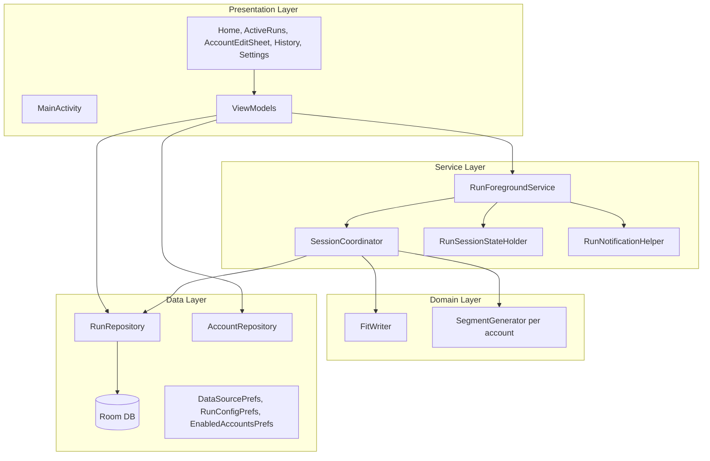
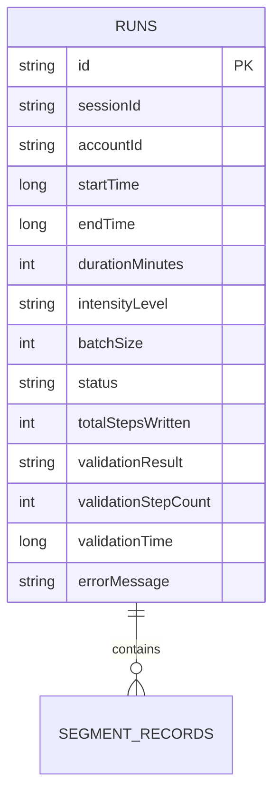
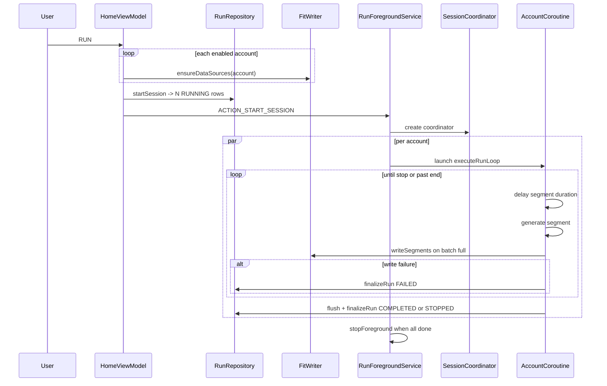
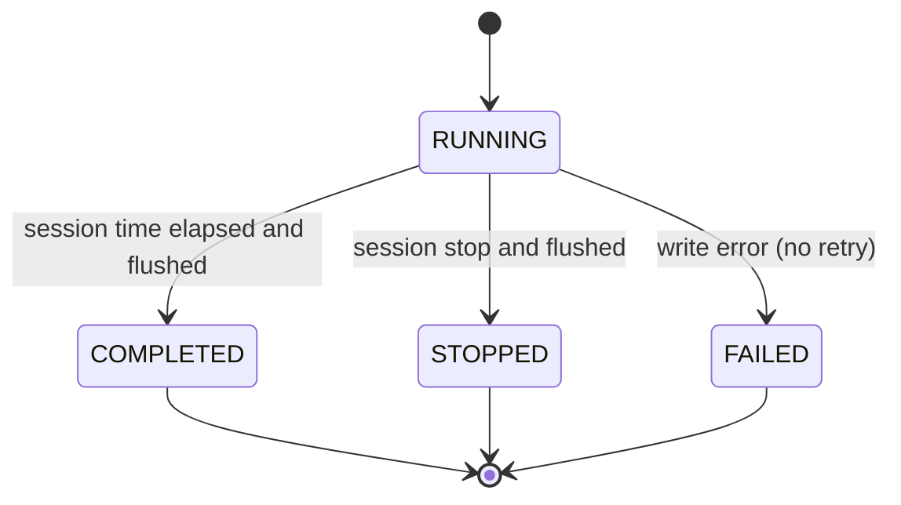
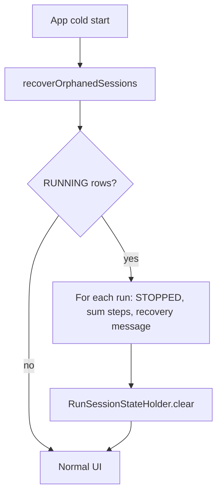

# APBFit — Software Design Specification (SDS)

| Field | Value |
|---|---|
| Project | APBFit — Auto Personal Boost Fit |
| Document | Software Design Specification |
| Version | 1.1 |
| Status | Draft for Implementation |
| Date | 2026-06-15 |
| Related Documents | [SRS v1.1](APBFit_SRS_v1.1_public.md), [SRS v1.0](APBFit_SRS_v1.0_public.md), [Development Guide](APBFit_Cursor_Prompt_public.md), [UI Draft](APBFit_v1.1_UI_draft.png) |

---

## Table of Contents

1. [Introduction](#1-introduction)
2. [Design Overview](#2-design-overview)
3. [Detailed Component Design](#3-detailed-component-design)
4. [Data Design](#4-data-design)
5. [Interface Design](#5-interface-design)
6. [Behavioral Design](#6-behavioral-design)
7. [Cross-Cutting Concerns](#7-cross-cutting-concerns)
8. [Requirements Traceability](#8-requirements-traceability)
9. [Testing Strategy](#9-testing-strategy)
10. [Implementation Plan and Sprint Breakdown](#10-implementation-plan-and-sprint-breakdown)
11. [Risks and Mitigations](#11-risks-and-mitigations)
12. [Open Questions](#12-open-questions)

---

## 1. Introduction

### 1.1 Purpose

This Software Design Specification (SDS) translates the requirements in [SRS v1.1](APBFit_SRS_v1.1_public.md) into a concrete software design for the v1.1 release. It extends the [SDS v1.0](APBFit_SDS_v1.0_public.md) baseline (already implemented) with design for **concurrent multi-account Run Sessions**, **Home UI simplification**, **configuration persistence**, **seven intensity presets**, **Traditional Chinese UI**, and **orphan session recovery**.

### 1.2 Scope

v1.1 builds on the existing v1.0 codebase. This document describes **new or changed** design elements. Unchanged behavior (Google Fit write mechanics, segment formulas, validation logging, 90-day retention, `FitWriter` seam) inherits from v1.0 unless explicitly overridden here.

**In scope:** concurrent Run Sessions, SessionCoordinator, schema/prefs changes, UI redesign per [UI draft](APBFit_v1.1_UI_draft.png), notification groups, full-session recovery, zh-TW strings.

**Out of scope:** custom intensity editing, i18n resource splitting, Health Connect, Play Store publication, and **cross-device / cloud-sync visibility** (pending; see SRS §10.x and the [Google Fit Sync Investigation](APBFit_GoogleFit_Sync_Investigation.md)). v1.1 designs for a **same-device** write guarantee only (SRS NFR-009).

### 1.3 Intended Audience

Android engineers, reviewers, and QA contributors implementing APBFit v1.1.

### 1.4 Definitions and Acronyms

Inherits v1.0 terms plus:

| Term | Definition |
|---|---|
| Run Session | One RUN action producing N concurrent `Run` rows sharing `sessionId`, `startTime`, and configuration. |
| SessionCoordinator | Component owning shared session clock, stop signal, and service lifecycle. |
| Enabled Account | Account ID in `EnabledAccountsPrefs` eligible for the next session. |
| Orphan Session | One or more `RUNNING` rows with no live Foreground Service session. |

### 1.5 References

- [APBFit SRS v1.1](APBFit_SRS_v1.1_public.md)
- [APBFit SRS v1.0](APBFit_SRS_v1.0_public.md)
- [APBFit SDS v1.0](APBFit_SDS_v1.0_public.md)
- [APBFit Development Guide](APBFit_Cursor_Prompt_public.md)
- [APBFit Versioning](APBFit_Versioning.md)

---

## 2. Design Overview

### 2.1 Design Goals and Constraints

| Goal / Constraint | Design Response |
|---|---|
| Concurrent multi-account runs (FR-004) | Single `RunForegroundService` + `SessionCoordinator` + one coroutine per account run |
| Synchronized end time (FR-009) | Shared `sessionEndMillis`; coordinator broadcasts stop |
| Independent randomness (FR-005) | Per-account `SegmentGenerator(Random(seed))`, `seed = hash(sessionId, accountId)` |
| Partial write failure (FR-010) | Failed account finalizes `FAILED`; others continue |
| All-or-nothing preflight (FR-002) | Sequential `ensureDataSources` for all enabled accounts before any `Run` insert |
| UI simplification (FR-003) | RUN-first Home layout; dropdown + sliders; compact environment icons |
| Traditional Chinese UI (NFR-008) | Single `values/strings.xml` in zh-TW; enum display names in Chinese |
| Orphan recovery (FR-019) | `recoverOrphanedSessions()` on cold start; conditional Settings action |
| Account isolation (NFR-005) | Unchanged; History uses explicit account dropdown |
| Substitutable write path (NFR-007) | Unchanged `FitWriter` seam |

### 2.2 Architectural Style

Still **MVVM + Repository**. v1.1 changes are concentrated in the **service layer** (session orchestration), **data layer** (`sessionId`, prefs), and **presentation layer** (screen restructure).



### 2.3 Technology Stack

Unchanged from v1.0 (Kotlin, Compose, Hilt, Room, Coroutines, Google Fit SDK). **New:** Jetpack DataStore (or SharedPreferences) for enabled-account set and run-config persistence.

### 2.4 Module Decomposition (v1.1 delta)

```
com.pixsonlin.apbfit
├── data
│   ├── db            RunEntity + sessionId (migration v1→v2)
│   ├── model         IntensityLevel (7 values), RunSessionConfig
│   ├── prefs         DataSourcePrefs, RunConfigPrefs, EnabledAccountsPrefs
│   └── repository    RunRepository (+ session APIs), AccountRepository (delta)
├── domain
│   └── fit           SegmentGenerator (unchanged API; per-instance Random)
├── service
│   ├── RunForegroundService      (refactored)
│   ├── SessionCoordinator        (new)
│   ├── RunSessionStateHolder     (new; replaces single RunStateHolder)
│   ├── AccountRunContext         (new; per-coroutine state)
│   └── RunNotificationHelper     (group + summary)
├── ui
│   ├── screen        Home (rewrite), ActiveRunsScreen (new), AccountEditSheet (new)
│   │                 History (+ account dropdown), Settings (+ recovery)
│   └── viewmodel     Home, ActiveRuns, History, Settings, Root (recovery)
```

---

## 3. Detailed Component Design

### 3.1 Data Layer (changes)

**`RunEntity` migration** — add column:

```kotlin
@Entity(tableName = "runs")
data class RunEntity(
    @PrimaryKey val id: String,
    val sessionId: String,          // NEW: shared UUID for concurrent session
    val accountId: String,
    // ... remaining fields unchanged
)
```

Room `version = 2` with `Migration(1, 2)` setting `sessionId = id` for existing rows (v1.0 single-run compatibility).

**`RunDao` changes:**

```kotlin
@Query("SELECT * FROM runs WHERE status = 'RUNNING'")
suspend fun getAllActiveRuns(): List<RunEntity>

@Query("SELECT * FROM runs WHERE status = 'RUNNING'")
fun observeActiveRuns(): Flow<List<RunEntity>>

@Query("SELECT * FROM runs WHERE sessionId = :sessionId")
suspend fun getRunsBySessionId(sessionId: String): List<RunEntity>

@Query("SELECT * FROM runs WHERE accountId = :accountId AND status = 'RUNNING' LIMIT 1")
suspend fun getActiveRunForAccount(accountId: String): RunEntity?
```

Remove reliance on `getActiveRun() LIMIT 1` for session logic.

**`RunRepository` session APIs:**

```kotlin
suspend fun startSession(config: RunSessionConfig, accountIds: List<String>): RunSessionStartResult
// Creates sessionId, N Run rows (RUNNING), returns sessionId + List<runId>

suspend fun recoverOrphanedSessions(recoveryMessage: String): Int
// Finalizes ALL RUNNING rows (grouped by sessionId), sums successful steps per run

fun observeActiveSession(): Flow<List<RunEntity>>

suspend fun hasRunningRows(): Boolean
```

**`RunConfigPrefs`** — stores `intensityLevel`, `durationMinutes`, `batchSize` (global).

**`EnabledAccountsPrefs`** — stores `Set<String>` of account IDs; default new accounts to enabled.

**`AccountRepository` delta** — remove "active account for runs" as primary Home concept; retain signed-in account list; `signOut(accountId)` without clearing history; block mutations during active session.

### 3.2 Domain Layer (changes)

**`IntensityLevel`** — seven entries with Traditional Chinese `displayName`:

```kotlin
enum class IntensityLevel(val displayName: String, val cadenceSpm: Int, val strideMeters: Double) {
    STROLL("散步", 80, 0.60),
    BRISK_WALK("快走", 110, 0.63),
    SUPER_SLOW_JOG("超慢跑", 140, 0.67),
    JOG("慢跑", 165, 0.70),
    MARATHON("馬拉松", 180, 0.78),
    FAST_RUN("快跑", 190, 0.92),
    SPRINT("衝刺", 210, 1.00),
}
```

**`SegmentGenerator`** — unchanged signature; service constructs one instance per account:

```kotlin
fun seedForAccount(sessionId: String, accountId: String): Random {
    val seed = (sessionId + accountId).hashCode().toLong()
    return Random(seed)
}
```

**`FitWriter`** — unchanged from v1.0.

### 3.3 Service Layer (major refactor)

**`SessionCoordinator`** (new, owned by `RunForegroundService`):

```kotlin
class SessionCoordinator(
    val sessionId: String,
    val sessionEndMillis: Long,
    val intensity: IntensityLevel,
    val batchSize: Int,
) {
    private val _stopRequested = MutableStateFlow(false)
    val stopRequested: StateFlow<Boolean> = _stopRequested

    fun requestStop() { _stopRequested.value = true }

    fun isPastEnd(): Boolean = System.currentTimeMillis() >= sessionEndMillis
}
```

Responsibilities:
- Hold shared `sessionEndMillis` and stop flag.
- Track active coroutine count; call `stopSelf()` when all account runs finalized.
- Expose session-level state to `RunSessionStateHolder`.

**`AccountRunContext`** (per coroutine):

- `runId`, `accountId`, `GoogleSignInAccount`
- `SegmentGenerator` with seeded `Random`
- Private `ArrayDeque<SegmentData>` batch queue
- `executeRunLoop()` — same inner logic as v1.0 `executeRun`, but reads stop from coordinator; on write failure finalizes **this** run only.

**`RunForegroundService` flow:**

1. `ACTION_START_SESSION` with `sessionId` and `List<runId>` (or reconstruct from DB).
2. Preflight already done in ViewModel; service loads runs + accounts.
3. Promote foreground with summary notification.
4. Launch `accountRuns.size` coroutines on `Dispatchers.Default`.
5. Each coroutine runs until coordinator stop or past end; flush; `finalizeRun`.
6. On coordinator stop (manual or time): set stop flag; all coroutines flush and exit.
7. When last coroutine completes → `stopForeground` + `stopSelf`.

**`RunSessionStateHolder`** replaces single `RunUiState`:

```kotlin
data class SessionUiState(
    val sessionId: String?,
    val intensityName: String,
    val elapsedMillis: Long,
    val remainingMillis: Long,
    val sessionStatusLabel: String,   // e.g. "2/3 進行中"
    val isActive: Boolean,
)

data class AccountRunUiState(
    val runId: String,
    val accountEmail: String,
    val totalSteps: Int,
    val segmentsWritten: Int,
    val status: RunStatus,
    val errorMessage: String?,
)

data class RunSessionUiState(
    val session: SessionUiState,
    val accounts: List<AccountRunUiState>,
)
```

**`RunNotificationHelper`:**

- Create notification channel `apbfit_run_channel` (unchanged).
- Post **summary** notification with `setGroupSummary(true)`, group key `apbfit_session_{sessionId}`.
- Post **child** notification per account with `setGroup(...)`, unique notification ID per `runId`.
- Summary shows `N/M 進行中`; children show account email, steps, remaining.
- Stop action on summary → `ACTION_STOP_SESSION`.

### 3.4 Presentation Layer (changes)

**Navigation (v1.1):**

| State | Route |
|---|---|
| No signed-in accounts | `SignInScreen` |
| Default | `HomeScreen` |
| Session active (optional auto) | `ActiveRunsScreen` pushed on RUN success |
| User nav | `HistoryScreen`, `SettingsScreen` |

Home is **not** replaced while session runs; user may leave ActiveRuns and return.

**`HomeScreen`** — layout per SRS FR-003 / UI draft:

1. Top bar: **APBFit**, 歷史紀錄, 設定
2. RUN button
3. Intensity `ExposedDropdownMenuBox`
4. Duration slider, batch slider (integer display)
5. Enabled-account list + 編輯 → `AccountEditSheet`
6. Environment icon row (3 icons)

**`AccountEditSheet`** — checkbox per account, delete (sign out), 新增 (Google Sign-In). Disabled during active session.

**`ActiveRunsScreen`** — session block + lazy list of account rows; single 停止 button.

**`HistoryScreen`** — account `ExposedDropdownMenuBox` at top; `observeRuns(selectedAccountId)`.

**`SettingsScreen`** — remove account switch UI; add conditional 重設進行中紀錄; keep clear history + shortcuts.

**`HomeViewModel.startSession()`:**

1. Validate ≥1 enabled account.
2. Preflight `ensureDataSources` for each enabled account; abort all on any failure.
3. `runRepository.startSession(config, enabledIds)`.
4. `runServiceStarter.startSession(sessionId)`.
5. Navigate to ActiveRuns.

**`RootViewModel` init** — call `recoverOrphanedSessions()` instead of single-row recovery.

### 3.5 Dependency Injection

Add providers for `RunConfigPrefs`, `EnabledAccountsPrefs` (`PrefsModule` or extend existing). `RunSessionStateHolder` as `@Singleton`.

---

## 4. Data Design

### 4.1 Schema (ER) — delta



Multiple `RUNS` rows may share the same `sessionId` (one per account).

### 4.2 Enumerations

`IntensityLevel` — see Section 3.2 and SRS §9. `RunStatus`, `ValidationResult` unchanged.

### 4.3 Preferences (non-Room)

| Store | Keys | Purpose |
|---|---|---|
| `RunConfigPrefs` | intensity, duration, batch | FR-018 |
| `EnabledAccountsPrefs` | enabled account ID set | FR-017 |
| `DataSourcePrefs` | per-account DS IDs | unchanged |
| `HistoryPrefs` (optional) | lastViewedAccountId | History dropdown default |

### 4.4 Retention

Unchanged: 90-day silent delete on app launch.

---

## 5. Interface Design

### 5.1 FitWriter Interface

Unchanged from v1.0. Batch failure returns `Result.failure` to the **calling account coroutine** only.

### 5.2 Repository Contracts (v1.1 additions)

```kotlin
data class RunSessionConfig(
    val durationMinutes: Int,
    val intensityLevel: IntensityLevel,
    val batchSize: Int,
)

data class RunSessionStartResult(
    val sessionId: String,
    val runs: List<RunStartEntry>,  // runId + accountId
)

suspend fun startSession(config: RunSessionConfig, accountIds: List<String>): RunSessionStartResult
suspend fun recoverOrphanedSessions(recoveryMessage: String): Int
fun observeActiveRuns(): Flow<List<RunEntity>>
```

### 5.3 Service Intents

```kotlin
// RunForegroundService
const val ACTION_START_SESSION = "...START_SESSION"
const val ACTION_STOP_SESSION = "...STOP_SESSION"
const val EXTRA_SESSION_ID = "extra_session_id"
```

### 5.4 UI State Contract

UI observes `RunSessionStateHolder.state: StateFlow<RunSessionUiState>`. Control: `ACTION_STOP_SESSION` via ViewModel → `RunServiceStarter.stopSession()`.

---

## 6. Behavioral Design

### 6.1 Run Session Lifecycle Sequence



### 6.2 Per-Account RunStatus (within session)



Other accounts in the same session may remain `RUNNING` when one account reaches `FAILED`.

### 6.3 Session Time and Stop

```
sessionStartMillis = time of RUN tap (shared across runs)
sessionEndMillis   = sessionStartMillis + durationMinutes * 60_000
```

Coordinator sets `stopRequested` when:
- User taps 停止 (FR-008), or
- `System.currentTimeMillis() >= sessionEndMillis` (FR-009)

All account coroutines observe the same flag in `delayUntilStopOrElapsed` chunks (reuse v1.0 polling pattern).

### 6.4 Orphan Recovery Flow



Manual path (Settings): same finalize logic gated on `!RunSessionStateHolder.isActive`.

### 6.5 Threading and Concurrency Model

| Work | Dispatcher / Scope |
|---|---|
| Session coordinator clock / stop | main-safe flag on coordinator |
| Per-account run loops | `Dispatchers.Default`, one coroutine each |
| Room / FitWriter | `Dispatchers.IO` via repository |
| UI | Compose main thread |

**Guards:** at most one active session; at most one `RUNNING` row per `accountId`.

---

## 7. Cross-Cutting Concerns

- **Error handling.** Per-account write failure does not stop siblings. Session UI reflects mixed states until all finalize.
- **Environment checks (FR-015).** `HomeViewModel` maps three icon states; FIT icon WARN if Google Fit missing **or** any enabled account lacks fitness permission.
- **Traditional Chinese (NFR-008).** All `strings.xml` entries in zh-TW; notification strings zh-TW; intensity `displayName` in enum. Brand **APBFit** not translated.
- **Account isolation.** History dropdown enforces scope; concurrent session still writes per-account DataSources.
- **Data visibility scope (SRS NFR-009).** `FitWriter.writeSegments` guarantees a write to the **local** Google Fit store on the writing device only. Google Fit cloud upload/download is passive (`WorkManager`-scheduled) and **cannot be forced** by any API; the design must not imply or depend on cross-device propagation. Cross-device sync is **pending** (SRS §10.x). Rationale and evidence: [Google Fit Sync Investigation](APBFit_GoogleFit_Sync_Investigation.md).
- **Privacy.** Unchanged from v1.0.
- **Permissions.** Unchanged from v1.0.

---

## 8. Requirements Traceability

| Requirement | Primary Design Element(s) |
|---|---|
| FR-001 Account management | `AccountRepository`, `AccountEditSheet`, `SignInScreen` |
| FR-002 DataSource preflight | `HomeViewModel.startSession`, `GoogleFitWriter` |
| FR-003 Run configuration | `HomeScreen`, `RunConfigPrefs`, dropdown/sliders |
| FR-004 Start session | `RunRepository.startSession`, `ACTION_START_SESSION` |
| FR-005 Segment generation | per-account `SegmentGenerator` + seed |
| FR-006 Batch write | per-account queue, `FitWriter` |
| FR-007 Notifications | `RunNotificationHelper` group + summary |
| FR-008 Session stop | `SessionCoordinator.requestStop`, flush all |
| FR-009 Session complete | coordinator time check, `COMPLETED` per run |
| FR-010 Per-account failure | account coroutine `finalizeRun(FAILED)` only |
| FR-011 History | account dropdown, `observeRuns(accountId)` |
| FR-012 Segment detail | unchanged expandable rows |
| FR-013 Validation | unchanged bottom sheet |
| FR-014 Settings | recovery action, shortcuts, clear history |
| FR-015 Environment icons | `HomeScreen` icon row |
| FR-016 ActiveRuns | `ActiveRunsScreen`, `RunSessionStateHolder` |
| FR-017 Enabled accounts | `EnabledAccountsPrefs`, `AccountEditSheet` |
| FR-018 Config persist | `RunConfigPrefs` |
| FR-019 Orphan recovery | `recoverOrphanedSessions`, Settings button |
| NFR-001..007 | inherited / session foreground service |
| NFR-008 zh-TW UI | `strings.xml`, enum display names |

---

## 9. Testing Strategy

Same rigor as v1.0: **pure-logic unit tests + manual QA** (no instrumented/UI automation, no CI in v1.1).

**Automated unit tests (new/updated):**
- `SegmentGenerator` with seeded `Random`: deterministic per `(sessionId, accountId)`; seven intensity levels produce valid bounds.
- `seedForAccount`: two accounts in same session produce different segment sequences with same config.
- `recoverOrphanedSessions`: multiple `RUNNING` rows finalize; `totalStepsWritten` matches segment sum.
- Session status label helper: `N/M 進行中`, `已完成（X 失敗）`.

**Manual QA checklist (v1.1 release):**
- Add 2+ accounts; enable subset; RUN starts session; auto-navigate ActiveRuns.
- Verify different step totals per account for same duration/intensity.
- Session stop → all accounts `STOPPED`; time expiry → all `COMPLETED`.
- Force one account write failure → that account `FAILED`, others complete.
- Preflight failure on one account → no runs created, error shown.
- Home config persists across restart and after session end.
- History account dropdown switches lists correctly.
- Notification summary + expandable per-account children; summary Stop works.
- Kill app mid-session → relaunch → all runs `STOPPED` with recovery message; RUN works again.
- Settings 重設進行中紀錄 visible only when orphaned; confirmation works.
- All user-visible strings Traditional Chinese; Home title **APBFit**.
- Regression: sign-in, validation logging, 90-day retention, screen-off reliability.

---

## 10. Implementation Plan and Sprint Breakdown

### 10.1 Estimation Assumptions

Same as v1.0 SDS:

- Role: one part-time **senior** Android engineer.
- Capacity: **~20 productive hours/week**; sprint length **2 weeks** → effective budget **~36–40 h/sprint**.
- Estimates include local manual verification, not calendar days.
- Testing per Section 9 (unit tests + manual QA).
- v1.1 builds on the completed v1.0 codebase (not greenfield).
- Estimated total effort: **~200–210 h** across **6 sprints (~12 weeks)**.

### 10.2 Sprint Summary

| Sprint | Theme | Effort | Verifiable Deliverable |
|---|---|---|---|
| S1 | Data migration, prefs, intensity, i18n foundation | ~34 h | Room v2 with `sessionId`; 7-level enum; prefs read/write; zh-TW strings pass compile; segment tests green. |
| S2 | Session engine refactor | ~40 h | Multi-account session runs end-to-end via debug trigger; independent randomness; per-account failure isolation. |
| S3 | Notifications, preflight, orphan recovery | ~36 h | Notification group; all-or-nothing preflight; cold-start recovery for full session. |
| S4 | Home + ActiveRuns UI | ~36 h | New Home layout; AccountEditSheet; ActiveRuns; RUN → navigate; Traditional Chinese on primary flows. |
| S5 | History, Settings, config persist | ~32 h | History account dropdown; config memory; Settings recovery button; enabled-account persistence. |
| S6 | Hardening and sideload release | ~32 h | Signed sideload APK; SRS v1.1 acceptance checklist; no P1 defects; GitHub Issues #1–#4 closed. |

### 10.3 Sprint Detail

#### Sprint 1 — Data Migration, Prefs, Intensity, i18n Foundation (~34 h)

- Scope: Room migration `1→2` (`sessionId` on `RunEntity`); `RunDao` active-session queries; `RunConfigPrefs`, `EnabledAccountsPrefs`; expand `IntensityLevel` to 7 values with zh-TW names; bulk update `strings.xml` to Traditional Chinese (core screens); update `SegmentGeneratorTest` for new levels and seeded random helper; `RunRepository.startSession` / `recoverOrphanedSessions` stubs.
- Acceptance: `./gradlew assembleDebug` succeeds; migration runs on existing v1.0 DB without crash; prefs round-trip; unit tests pass; app still launches (UI may be v1.0 layout temporarily).

#### Sprint 2 — Session Engine Refactor (~40 h)

- Scope: `SessionCoordinator`, `AccountRunContext`, refactor `RunForegroundService` to multi-coroutine model; `RunSessionStateHolder`; `ACTION_START_SESSION` / `ACTION_STOP_SESSION`; per-account `FAILED` without stopping siblings; shared `sessionEndMillis`; remove single-run `LIMIT 1` assumptions in service; debug entry point starts 2-account session.
- Acceptance: debug-triggered 2-account session writes to both Google Fit accounts; step counts differ; one injected failure fails only that account; manual session stop flushes all; screen-off survives multi-minute session.

#### Sprint 3 — Notifications, Preflight, Orphan Recovery (~36 h)

- Scope: `RunNotificationHelper` summary + `NotificationGroup` children; `HomeViewModel` all-or-nothing `ensureDataSources` before `startSession`; `RootViewModel` + `recoverOrphanedSessions` for all `RUNNING` rows; stale-session retry on RUN blocked; coordinator time-based auto-stop.
- Acceptance: notifications show summary and per-account children; preflight abort leaves no `RUNNING` rows; force-kill app → relaunch → orphans recovered; natural session completion marks all `COMPLETED`.

#### Sprint 4 — Home + ActiveRuns UI (~36 h)

- Scope: rewrite `HomeScreen` per UI draft (RUN top, dropdown, sliders, account list, environment icons); `AccountEditSheet`; `ActiveRunsScreen` with session + per-account blocks; navigation auto-push on RUN; top bar **APBFit** / 歷史紀錄 / 設定; disable edits during active session.
- Acceptance: user completes happy path entirely in zh-TW UI: enable accounts → configure → RUN → ActiveRuns live stats → 停止; no scroll required to reach RUN on typical device.

#### Sprint 5 — History, Settings, Config Persist (~32 h)

- Scope: `HistoryScreen` account dropdown + last-selected persistence; wire `RunConfigPrefs` / `EnabledAccountsPrefs` to Home; `SettingsScreen` 重設進行中紀錄 (conditional) + remove obsolete account-switch UI; sign-out from AccountEditSheet; validation sheet zh-TW strings.
- Acceptance: config survives app restart; History shows correct per-account runs; recovery button appears only for orphans; signing out from sheet retains history until cleared.

#### Sprint 6 — Hardening and Sideload Release (~32 h)

- Scope: edge cases (zero enabled accounts, single-account session, session already active, permission edge cases); error/empty states; accessibility pass on new controls; update `versionName` per [Versioning](APBFit_Versioning.md); full manual QA checklist; signed release APK.
- Acceptance: SRS v1.1 FR/NFR acceptance passes; no P1 defects; release build installable on clean device; Issues #1–#4 verified fixed.

---

## 11. Risks and Mitigations

| Risk | Impact | Mitigation |
|---|---|---|
| Multi-coroutine service complexity | Race conditions, duplicate finalization | Single `SessionCoordinator`; structured coroutine scope; idempotent `finalizeRun` |
| Orphan `RUNNING` rows after OEM kill | User blocked from new RUN | FR-019 recovery on launch + Settings escape hatch; QA force-kill in S3/S6 |
| Notification group OEM variance | Summary/children not grouped on some devices | Test on 2+ OEMs; summary still usable standalone |
| Room migration failure on user devices | Crash on upgrade | Migration sets `sessionId = id`; test upgrade from v1.0 DB |
| zh-TW string audit incomplete | English leaks in UI | S4/S6 string audit checklist; lint for hardcoded strings |
| Background execution (inherited) | Session interrupted | Same mitigations as v1.0; multi-account increases blast radius — session-level QA |
| Cross-device data not visible | User expects device-B visibility | **Accepted platform limitation** (SRS NFR-009); documented as same-device-only guarantee + pending sync (SRS §10.x, [Sync Investigation](APBFit_GoogleFit_Sync_Investigation.md)); no v1.1 UI implies cross-device |
| Part-time schedule slip | Delayed release | Same ~36–40 h/sprint buffer as v1.0; each sprint has independent deliverable |

---

## 12. Open Questions

None blocking. v1.2 custom intensity remains conditional per SRS §10. Multi-language i18n deferred to a future minor release.

**Resolved (2026-06-21):** cross-device / cloud-sync visibility was investigated and confirmed to be an un-forceable Google Fit platform limitation. It is now scoped out of v1.1 (same-device guarantee, SRS NFR-009) and tracked as a pending capability (SRS §10.x). See [Google Fit Sync Investigation](APBFit_GoogleFit_Sync_Investigation.md).

---

*End of SDS v1.1*
