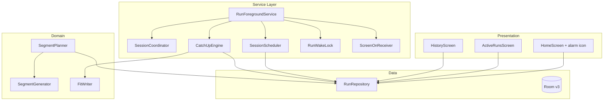
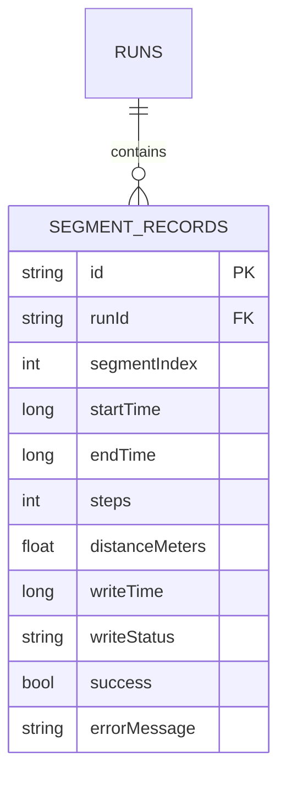
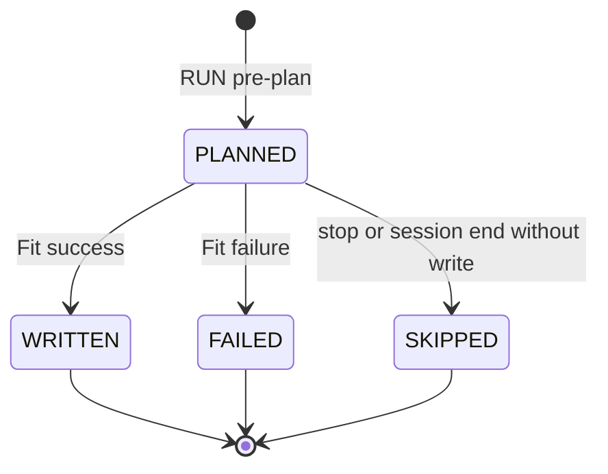
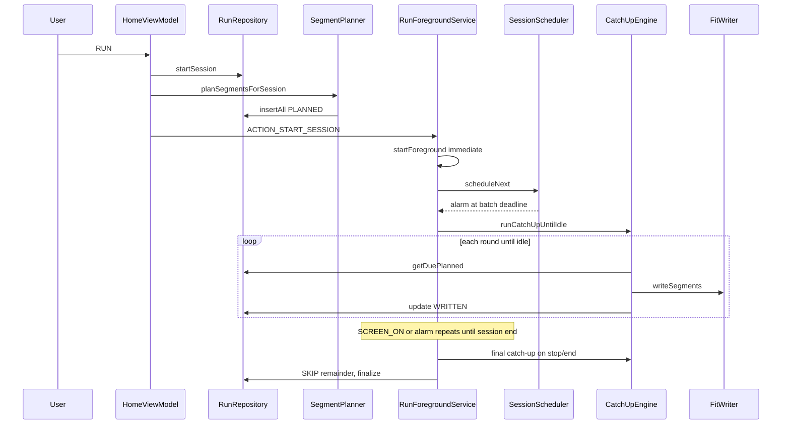
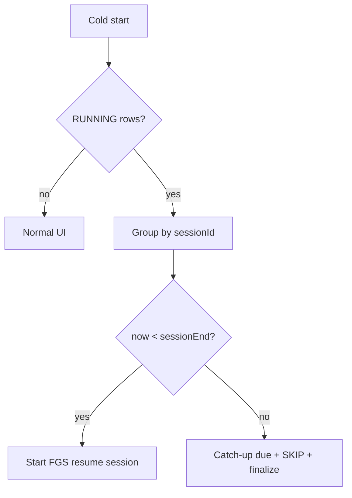

# APBFit — Software Design Specification (SDS)

| Field | Value |
|---|---|
| Project | APBFit — Auto Personal Boost Fit |
| Document | Software Design Specification |
| Version | 1.2 |
| Status | Approved for Development |
| Date | 2026-06-22 |
| Related Documents | [SRS v1.2](APBFit_SRS_v1.2_public.md), [SRS v1.1](APBFit_SRS_v1.1_public.md), [SDS v1.1](APBFit_SDS_v1.1_public.md), [2hr Batch Power Estimate](APBFit_2hr_Batch_Power_Estimate.md), [Development Guide](APBFit_Cursor_Prompt_public.md) |

---

## Table of Contents

1. [Introduction](#1-introduction)
2. [Design Overview](#2-design-overview)
3. [Detailed Component Design](#3-detailed-component-design)
4. [Data Design](#4-data-design)
5. [Interface Design](#5-interface-design)
6. [Behavioral Design](#6-behavioral-design)
7. [Cross-Cutting Concerns](#7-cross-cutting-concerns)
8. [Requirements Traceability](#8-requirements-traceability)
9. [Testing Strategy](#9-testing-strategy)
10. [Implementation Plan — Sprint 1 (v1.2)](#10-implementation-plan--sprint-1-v12)
11. [Risks and Mitigations](#11-risks-and-mitigations)
12. [Open Questions](#12-open-questions)

---

## 1. Introduction

### 1.1 Purpose

This SDS translates [SRS v1.2](APBFit_SRS_v1.2_public.md) into a concrete design for the **scheduled write engine** release. It builds on the shipped v1.1 codebase and replaces the delay-loop run engine with **segment pre-planning**, **deadline scheduling**, **throttled catch-up**, and **orphan session resume**.

### 1.2 Scope

**In scope:** Room schema v3 (`writeStatus`), `SegmentPlanner`, `SessionScheduler`, `CatchUpEngine`, `RunWakeLock`, alarm + `SCREEN_ON` integration, FR-015 alarm environment check, History/ActiveRuns UI delta, orphan resume, Android 15 `onTimeout`, immediate `startForeground`.

**Out of scope:** orphan abandon toggle (v1.4), custom intensity (v1.3), cross-device sync, Play Store.

**Inherited unchanged from v1.1 unless overridden:** Google Fit three-call batch write, validation logging, 90-day retention, `FitWriter` seam, multi-account session UI, Traditional Chinese strings.

### 1.3 Intended Audience

Android engineers and QA implementing v1.2.

### 1.4 Definitions

Inherits v1.1 plus SRS v1.2 terms (`Planned Segment`, `Catch-up Round`, `Session Scheduler`, `Batch Deadline`).

### 1.5 References

- [APBFit SRS v1.2](APBFit_SRS_v1.2_public.md)
- [APBFit SDS v1.1](APBFit_SDS_v1.1_public.md)
- [APBFit 2hr Batch Power Estimate](APBFit_2hr_Batch_Power_Estimate.md)
- [RunSessionPowerEstimate.kt](../app/src/main/java/com/pixson/apbfit/domain/RunSessionPowerEstimate.kt) (analytical helper; optional for tests)

---

## 2. Design Overview

### 2.1 Design Goals and Constraints

| Goal / Constraint | Design Response |
|---|---|
| Screen-off reliability (NFR-001, Issue #5) | Pre-plan + alarm/deadline wake + catch-up; remove 500 ms polling |
| Full-session FGS notification (product) | Keep `RunForegroundService` alive entire session; scheduler runs inside service |
| Retrospective Fit writes (NFR-004) | Batch only when all segments in batch have `endTime <= now` |
| Power vs accuracy | Exact alarm when allowed; session WakeLock fallback; see Power Estimate doc |
| Multi-account fairness (FR-021) | `batchesPerAccount = max(1, ceil(3 / N))` per catch-up round |
| Orphan resume (FR-019) | Cold start resumes session if before `sessionEnd`; else catch-up finalize |
| Android 15 six-hour cap (NFR-010) | `onTimeout()` → catch-up + finalize; accepted limit |
| Write failure (FR-010) | Unchanged per-account FAILED |

### 2.2 Architectural Style

Still **MVVM + Repository**. v1.2 concentrates changes in **data layer** (segment status, planning), **service layer** (scheduler, catch-up, wake lock, receiver), and **presentation** (History/ActiveRuns/Environment).



### 2.3 Technology Stack

Unchanged (Kotlin, Compose, Hilt, Room, Coroutines, Google Fit SDK). **New manifest permissions:** `WAKE_LOCK`, `SCHEDULE_EXACT_ALARM`.

### 2.4 Module Decomposition (v1.2 delta)

```
com.pixson.apbfit
├── data
│   ├── db            SegmentRecordEntity + writeStatus (migration v2→v3)
│   ├── model         SegmentWriteStatus enum
│   └── repository    planSegmentsForSession, queryDuePlanned, updateSegmentStatus
├── domain
│   ├── SegmentPlanner.kt          (new)
│   ├── CatchUpThrottle.kt         (new; constants + round logic)
│   └── RunSessionPowerEstimate.kt   (existing analysis helper)
├── service
│   ├── RunForegroundService       (scheduler-driven; onTimeout; immediate startForeground)
│   ├── SessionScheduler.kt        (new; AlarmManager)
│   ├── CatchUpEngine.kt           (new)
│   ├── RunWakeLock.kt             (new)
│   ├── ScreenOnReceiver.kt        (new; dynamic register)
│   ├── AccountRunContext.kt       (refactored: write-only path, no delay loop)
│   └── SessionCoordinator.kt      (minimal delta)
├── ui
│   ├── EnvironmentChecker.kt      (+ exact alarm)
│   ├── HistoryScreen / ViewModel  (+ pending/skipped labels, filter)
│   └── ActiveRunsScreen             (+ planned segment count)
```

---

## 3. Detailed Component Design

### 3.1 Data Layer

#### 3.1.1 `SegmentWriteStatus`

```kotlin
enum class SegmentWriteStatus {
    PLANNED,
    WRITTEN,
    FAILED,
    SKIPPED,
}
```

#### 3.1.2 `SegmentRecordEntity` (v3)

```kotlin
@Entity(tableName = "segment_records", /* FK unchanged */)
data class SegmentRecordEntity(
    @PrimaryKey val id: String,
    val runId: String,
    val segmentIndex: Int,
    val startTime: Long,
    val endTime: Long,
    val steps: Int,
    val distanceMeters: Float,
    val writeTime: Long,              // 0 when PLANNED or SKIPPED
    val writeStatus: String,          // SegmentWriteStatus.name
    val success: Boolean,
    val errorMessage: String?,
)
```

**Migration 2→3:** add `writeStatus TEXT NOT NULL DEFAULT 'WRITTEN'`; backfill existing rows: `success=1 → WRITTEN`, else `FAILED`.

#### 3.1.3 `SegmentRecordDao` additions

```kotlin
@Query(
    "SELECT * FROM segment_records WHERE runId = :runId AND writeStatus = 'PLANNED' " +
        "AND endTime <= :now ORDER BY segmentIndex LIMIT :limit",
)
suspend fun getDuePlanned(runId: String, now: Long, limit: Int): List<SegmentRecordEntity>

@Query(
    "SELECT * FROM segment_records WHERE runId = :runId ORDER BY segmentIndex",
)
fun observeSegmentsForHistory(runId: String): Flow<List<SegmentRecordEntity>>
// ViewModel filters: PLANNED only if endTime <= now

@Query("SELECT COUNT(*) FROM segment_records WHERE runId = :runId")
suspend fun countPlannedSegments(runId: String): Int

@Query(
    "SELECT COALESCE(SUM(steps), 0) FROM segment_records " +
        "WHERE runId = :runId AND writeStatus = 'WRITTEN'",
)
suspend fun sumWrittenSteps(runId: String): Int

@Update
suspend fun updateAll(segments: List<SegmentRecordEntity>)
```

#### 3.1.4 `RunRepository` additions

```kotlin
suspend fun planSegmentsForSession(sessionId: String): Unit
// Load runs for session; for each run, SegmentPlanner.generateAll(); insertAll PLANNED in transaction

suspend fun getDuePlannedSegments(runId: String, now: Long, limit: Int): List<SegmentRecordEntity>

suspend fun markSegmentsSkipped(runId: String, fromIndexExclusive: Int? = null): Unit

suspend fun resumeOrFinalizeOrphanSession(sessionId: String, recoveryMessage: String): OrphanRecoveryResult

data class OrphanRecoveryResult(
    val action: RESUME | FINALIZE,
    val sessionId: String,
)
```

**`startSession` flow change (HomeViewModel):**

1. Preflight (unchanged)
2. `runRepository.startSession(...)`
3. **`runRepository.planSegmentsForSession(sessionId)`**
4. `runServiceStarter.startSession(sessionId)`

### 3.2 Domain Layer

#### 3.2.1 `SegmentPlanner`

```kotlin
class SegmentPlanner(private val segmentGenerator: SegmentGenerator) {
    fun planAllSegments(
        runStartMillis: Long,
        sessionEndMillis: Long,
        intensity: IntensityLevel,
    ): List<SegmentData> {
        // Loop: nextDurationSec until nextSegmentStart + duration would exceed sessionEnd
        // Same formulas as v1.1 SegmentGenerator
    }
}
```

- Invoked once per run at session start.
- Persist via repository as `SegmentRecordEntity` with `writeStatus = PLANNED`.

#### 3.2.2 `CatchUpThrottle`

```kotlin
object CatchUpThrottle {
    const val MAX_BATCHES_PER_CATCH_UP = 3
    const val DELAY_BETWEEN_BATCHES_MS = 1_000L
    const val MAX_SEGMENTS_PER_CATCH_UP = 20
    const val MAX_CATCH_UP_WALL_CLOCK_MS = 30_000L
    const val SCHEDULE_SLACK_MS = 5_000L

    fun batchesPerAccount(accountCount: Int): Int =
        max(1, ceil(MAX_BATCHES_PER_CATCH_UP.toDouble() / accountCount).toInt())
}
```

### 3.3 Service Layer

#### 3.3.1 `RunWakeLock`

```kotlin
class RunWakeLock(context: Context) {
    fun acquireForWrite()   // PARTIAL, tag "APBFit:Write"
    fun releaseWrite()
    fun acquireSession()    // when !canScheduleExactAlarms()
    fun releaseSession()
}
```

- Always `try/finally` release in `CatchUpEngine` and service `onDestroy`.

#### 3.3.2 `SessionScheduler`

Responsibilities:

- Compute **next batch deadline** per run: smallest `endTime` among next `batchSize` PLANNED segments (or next single segment if partial batch at end).
- Session deadline = `min(account deadlines, sessionEndMillis)`.
- Schedule one `PendingIntent` to `RunForegroundService` (`ACTION_SCHEDULE_TICK`).
- Reschedule after each successful catch-up round or when plan advances.
- Cancel all alarms on session stop/finalize.

**Alarm API selection:**

```kotlin
if (alarmManager.canScheduleExactAlarms()) {
    alarmManager.setExactAndAllowWhileIdle(RTC_WAKEUP, triggerAtMillis, pendingIntent)
} else {
    alarmManager.setAndAllowWhileIdle(RTC_WAKEUP, triggerAtMillis, pendingIntent)
    wakeLock.acquireSession()
}
```

#### 3.3.3 `CatchUpEngine`

```kotlin
class CatchUpEngine(
    private val runRepository: RunRepository,
    private val fitWriter: FitWriter,
    private val wakeLock: RunWakeLock,
    private val coordinator: SessionCoordinator,
) {
    suspend fun runCatchUpUntilIdle(sessionId: String): CatchUpResult
}
```

**Algorithm (per wakeup):**

```
now = currentTimeMillis()
deadline = min(now, sessionEndMillis)
repeat {
  roundStart = now
  for each running account (round-robin or parallel with limit) {
    batchesLeft = CatchUpThrottle.batchesPerAccount(N)
    segmentsLeft = MAX_SEGMENTS_PER_CATCH_UP
    while batchesLeft > 0 && segmentsLeft > 0 && hasDuePlanned(account) {
      batch = take next batchSize due PLANNED segments
      writeBatchViaFit (WakeLock acquireForWrite/releaseWrite)
      on failure → finalize account FAILED, continue others
      batchesLeft--
      segmentsLeft -= batch.size
      delay(DELAY_BETWEEN_BATCHES_MS)
    }
  }
  if no due PLANNED for any account → break
  if elapsed since roundStart >= MAX_CATCH_UP_WALL_CLOCK_MS → continue next round (same wakeup)
} until no due PLANNED or stop requested
reschedule next alarm
```

**Multi-round:** outer loop continues within same service wakeup until backlog cleared (FR-021).

#### 3.3.4 `AccountRunContext` (refactored)

- **Remove** `executeRunLoop()` delay/generate loop.
- **Add** `writePlannedBatch(segments: List<SegmentRecordEntity>)` — maps entities to `SegmentData`, calls `FitWriter`, updates rows to WRITTEN/FAILED.
- Force-fail debug path preserved on first write.

#### 3.3.5 `RunForegroundService` (delta)

**`onStartCommand`:**

```kotlin
ACTION_START_SESSION -> {
    promoteForegroundImmediate()  // placeholder notification
    startSessionLoop(sessionId)
}
ACTION_SCHEDULE_TICK -> coordinator?.onScheduleTick()
ACTION_STOP_SESSION -> coordinator?.requestStop()
```

**`executeSession` (revised):**

1. Load runs; build coordinator + state holder.
2. Register `ScreenOnReceiver`; acquire session WakeLock if needed.
3. `sessionScheduler.scheduleNext(sessionId)`.
4. **`catchUpEngine.runCatchUpUntilIdle(sessionId)`** (initial due segments if any).
5. Suspend on coordinator stop channel / await finalize.
6. On stop: catch-up due → skip remainder → finalize all accounts.
7. Unregister receiver; release WakeLock; cancel alarms.

**`onTimeout(startId, fgsType)` (API 35+):**

- Log; run FR-009 final catch-up path; finalize; `stopSelf()`.

**Immediate foreground:** extract `promoteForegroundImmediate()` called synchronously at top of `ACTION_START_SESSION` before coroutine DB work.

#### 3.3.6 `ScreenOnReceiver`

- Dynamic register in service when session starts.
- `Context.RECEIVER_NOT_EXPORTED` on API 33+.
- On `ACTION_SCREEN_ON`: if coordinator active and behind schedule → `catchUpEngine.runCatchUpUntilIdle`.

### 3.4 Presentation Layer

#### 3.4.1 `EnvironmentChecker`

Add fourth check:

```kotlin
fun canScheduleExactAlarms(): Boolean =
    Build.VERSION.SDK_INT < 31 || alarmManager.canScheduleExactAlarms()
```

Home icon row: **Alarm / 鬧鐘** — WARN → intent to `Settings.ACTION_REQUEST_SCHEDULE_EXACT_ALARM` or app alarm settings.

#### 3.4.2 `HistoryViewModel`

- Map `writeStatus` to labels: 待寫入 / 成功 / 失敗 / 已跳過.
- Filter display list:
  - Include if `writeStatus != PLANNED` OR `endTime <= now`.

#### 3.4.3 `ActiveRunsScreen` / `RunSessionStateHolder`

- Add `segmentsPlanned: Int` per account (count all planned for run).
- Display `segmentsWritten / segmentsPlanned`.

#### 3.4.4 `RootViewModel` / orphan recovery

Replace `recoverOrphanedSessions` finalize-all with:

```kotlin
for each distinct sessionId in RUNNING rows {
  if now < sessionEnd -> startForegroundService(resume) // OrphanRecoveryResult.RESUME
  else -> catchUpEngine.finalizeSession(sessionId)
}
```

Settings manual reset uses finalize path only (unchanged visibility gate).

---

## 4. Data Design

### 4.1 Schema ER (delta)



### 4.2 Segment lifecycle



### 4.3 Retention

Unchanged: cascade delete segments with runs older than 90 days.

---

## 5. Interface Design

### 5.1 Service Intents (additions)

```kotlin
const val ACTION_SCHEDULE_TICK = "...SCHEDULE_TICK"
// extras: EXTRA_SESSION_ID
```

### 5.2 `FitWriter`

Unchanged interface; batch input still `List<SegmentData>` built from planned entities.

---

## 6. Behavioral Design

### 6.1 Session Lifecycle (v1.2)



### 6.2 Stop sequence (FR-008)

1. `coordinator.requestStop()` + cancel alarms.
2. `catchUpEngine.runCatchUpUntilIdle` (due only, `endTime <= now`).
3. `markSegmentsSkipped` for remaining PLANNED per run.
4. `finalizeRun(STOPPED)` each account.
5. `stopForeground` + `stopSelf`.

### 6.3 Orphan recovery (FR-019)



### 6.4 Threading

| Work | Dispatcher |
|---|---|
| Catch-up / Fit writes | `Dispatchers.Default` in service scope |
| Room | `Dispatchers.IO` via repository |
| Alarm receiver | main thread → launch service IO work |
| UI | Main |

---

## 7. Cross-Cutting Concerns

- **Error handling:** Unchanged per-account FAILED; planned rows marked FAILED on batch failure.
- **Power:** See [2hr Batch Power Estimate](APBFit_2hr_Batch_Power_Estimate.md); v1.2 removes ~14k polls/run.
- **Traditional Chinese:** New strings for segment statuses and alarm environment icon.
- **Android 15:** NFR-010 documented in SRS; implement `onTimeout`.
- **Exact alarm denied:** Session WakeLock + inexact alarm + SCREEN_ON; Environment WARN.

---

## 8. Requirements Traceability

| Requirement | Primary Design Element |
|---|---|
| FR-004 start + immediate FGS | `RunForegroundService.onStartCommand` |
| FR-005 / FR-020 pre-plan | `SegmentPlanner`, `planSegmentsForSession` |
| FR-006 batch write | `AccountRunContext.writePlannedBatch`, `CatchUpEngine` |
| FR-007 / NFR-010 | full-session FGS, `onTimeout` |
| FR-008 / FR-009 stop/complete | `CatchUpEngine`, skip + finalize |
| FR-011 / FR-012 History | `HistoryViewModel` filter + status labels |
| FR-015 alarm env | `EnvironmentChecker`, Home icon |
| FR-016 ActiveRuns | `segmentsPlanned` in state holder |
| FR-019 orphan | `resumeOrFinalizeOrphanSession`, RootViewModel |
| FR-021 schedule + catch-up | `SessionScheduler`, `CatchUpEngine`, `CatchUpThrottle` |
| NFR-001 reliability | alarm + WakeLock + catch-up |
| NFR-004 integrity | due filter `endTime <= now` |

---

## 9. Testing Strategy

### 9.1 Automated unit tests

| Area | Tests |
|---|---|
| `SegmentPlanner` | segment count for 10/120/360 min; none beyond `sessionEnd`; deterministic seed |
| `CatchUpThrottle.batchesPerAccount` | N=1→3, N=2→2, N=3→1, N=4→1 |
| `CatchUpEngine` (fake repo/writer) | multi-round until idle; throttle caps; stop mid-catch-up |
| `SessionScheduler` | next deadline = min batch endTime; mock AlarmManager |
| Migration 2→3 | backfill writeStatus |
| Orphan recovery | before end → RESUME; after end → finalize + SKIP |
| History filter | PLANNED future hidden; due PLANNED shown |
| `RunSessionPowerEstimate` | regression on workload numbers |

### 9.2 Manual QA (release gate)

Reproduce [Issue #5](https://github.com/Pixson-Lin/APBFit/issues/5) scenarios:

| Case | Expected |
|---|---|
| 10 min run, screen off past session end | Wake → catch-up fills due segments; History shows 待寫入 then 成功 |
| 1 hr run, screen off 28 min | Timestamps contiguous; no 28 min wall-clock lag |
| batch=1 vs 3 | Both complete; throttle visible on large backlog |
| 2 accounts concurrent | Fair catch-up allocation |
| Stop mid-run | Due written; rest 已跳過 |
| Kill app mid-session, relaunch before end | Session resumes, continues writing |
| Kill app after end | Finalize with catch-up |
| Deny exact alarm | WARN icon; session WakeLock; still completes with screen-on |
| Android 15 device, 6 hr run background | May `onTimeout`; graceful finalize |

---

## 10. Implementation Plan — Sprint 1 (v1.2)

### 10.1 Estimation Assumptions

- One part-time senior Android engineer, ~20 h/week.
- **Single sprint, 2 weeks, ~38–42 h** (focused delta on v1.1 codebase).
- Includes unit tests (§9.1) and manual QA (§9.2).
- **Implementation starts only after this SDS is approved** (no code before doc sign-off).

### 10.2 Sprint 1 — Scheduled Write Engine (v1.2)

| Field | Value |
|---|---|
| Theme | Pre-plan + Scheme C scheduler + catch-up + orphan resume |
| Effort | ~40 h |
| Deliverable | Sideload-ready v1.2 addressing Issue #5 |

#### Phase A — Data & planning (~10 h)

- Room migration v2→v3 (`writeStatus` on `segment_records`).
- `SegmentWriteStatus`, DAO queries, repository APIs.
- `SegmentPlanner` + `planSegmentsForSession`.
- Wire `HomeViewModel.startSession` to plan before service start.
- Unit tests: planner bounds, migration, planned row insert.

#### Phase B — Service core (~14 h)

- `CatchUpThrottle`, `RunWakeLock`, `CatchUpEngine`, `SessionScheduler`.
- Refactor `AccountRunContext` to write-planned-batch only.
- Rewrite `RunForegroundService` session loop (remove delay loop).
- Immediate `startForeground`; new intents; `ScreenOnReceiver`.
- Manifest: `WAKE_LOCK`, `SCHEDULE_EXACT_ALARM`.
- Unit tests: throttle math, catch-up rounds (fakes).

#### Phase C — Recovery, API 35, environment (~6 h)

- Orphan resume/finalize in `RunRepository` + `RootViewModel`.
- `onTimeout()` implementation.
- `EnvironmentChecker` exact-alarm icon + strings.
- Adjust Settings recovery to finalize path.

#### Phase D — UI & labels (~4 h)

- History: filter + 待寫入 / 已跳過 labels.
- ActiveRuns: `segmentsWritten / segmentsPlanned`.
- `segmentStatusLabelRes` extension for write status.

#### Phase E — Hardening & release (~6 h)

- Manual QA checklist (§9.2) on 2 devices (incl. one API 31–34, one API 35 if available).
- Edge cases: zero due at start, partial last batch, one account FAILED mid-session.
- Version bump per [Versioning](APBFit_Versioning.md) (`1.2.YYYYMMDD`).
- Update README status; close Issue #5 with test notes.

### 10.3 Sprint 1 acceptance criteria

- [ ] All segments for a run exist as PLANNED in Room before first Fit write.
- [ ] Screen-off 10 min test: due segments appear in History (待寫入) and become 成功 after catch-up.
- [ ] No 500 ms polling loop in `AccountRunContext`.
- [ ] Stop writes due PLANNED; remainder SKIPPED with label.
- [ ] Orphan before `sessionEnd` resumes without spurious STOPPED message.
- [ ] Exact-alarm WARN visible when permission revoked; RUN still works.
- [ ] `./gradlew testDebugUnitTest` green.
- [ ] Signed debug/release APK installable.

---

## 11. Risks and Mitigations

| Risk | Impact | Mitigation |
|---|---|---|
| OEM alarm delay | Missed deadlines | SCREEN_ON catch-up; session WakeLock fallback; slack 5 s |
| Exact alarm revoked | Drift | Environment WARN; session WakeLock; inexact alarm |
| Cold-start Fit latency | First batch fails | Preflight ensureDataSources; optional warm-up in service start |
| Catch-up overload | API timeout | FR-021 throttle; multi-round same wakeup |
| Multi-account race | Double write | DB status CAS or transaction: only PLANNED→WRITTEN if still PLANNED |
| Android 15 6 hr cap | Long run cut | NFR-010 accepted; onTimeout flush; user doc |
| History noise (待寫入) | UX confusion | Only show due PLANNED; zh-TW copy |
| Migration failure | Upgrade crash | Test v1.1 DB → v1.2 migration path |

---

## 12. Open Questions

None blocking v1.2 implementation.

**Deferred:**

- **v1.4:** Settings toggle to abandon unwritten PLANNED on orphan recovery instead of resume (SRS §10).
- **v1.3:** Custom intensity parameters.

**Resolved for v1.2:**

- Full-session FGS notification retained.
- Pre-plan inserts to Room before Fit API.
- Catch-up throttle constants and multi-account `ceil(3/N)` allocation.
- 6 hr Android 15 limit accepted.

---

*End of SDS v1.2*
